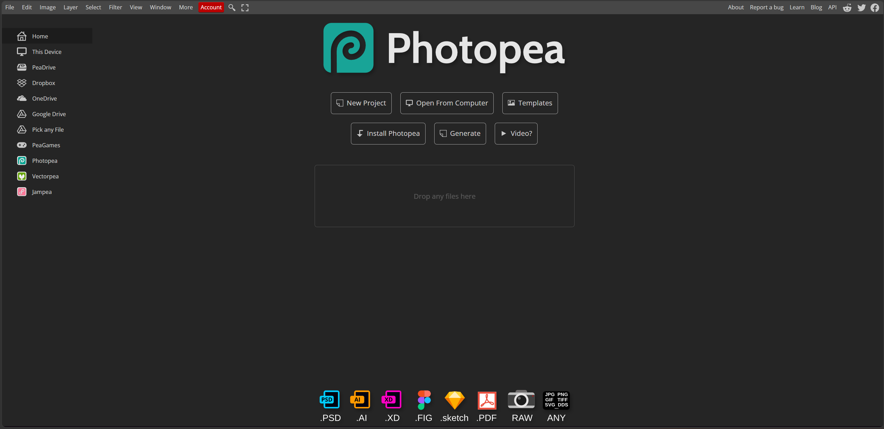

<div align="center">
  

  <h1>Photopea True Fullscreen</h1>

  <p><strong>Let Photopea use the whole damn window.</strong></p>

  <a href="https://raw.githubusercontent.com/ghostlybliss/Photopea-Fullscreen-2026/main/photopea-fullscreen.user.js">
    
  </a>

  <a href="https://greasyfork.org/en/scripts/567062-photopea-true-fullscreen">
    
  </a>

  <a href="https://github.com/ghostlybliss/Photopea-Fullscreen-2026/releases">
    
  </a>

  <a href="LICENSE">
    
  </a>
</div>

---



Photopea can reserve a large empty area on the right side of the window.

**Photopea True Fullscreen** makes the editor use that space instead.

There is little reason to surrender perfectly good screen space to nothing.

---

## Features

- Full-width Photopea workspace
- Removes the reserved area on the right
- Tested on Microsoft Edge and Brave
- Re-applies the layout after switching tabs, refocusing, and resizing
- Keeps the width spoof active during long sessions
- Hides Photopea's specific `"Something is changing our source code"` warning when triggered by the script
- No themes
- No UI recoloring
- No external libraries

---

## Install

### 1. GitHub — Direct Install

[](https://raw.githubusercontent.com/ghostlybliss/Photopea-Fullscreen-2026/main/photopea-fullscreen.user.js)

If Tampermonkey or Violentmonkey is installed, opening the link above should bring up the userscript installation screen.

### 2. Greasy Fork

[](https://greasyfork.org/en/scripts/567062-photopea-true-fullscreen)

Use this if you prefer installing and receiving updates through Greasy Fork.

### 3. Manual

1. Install Tampermonkey or Violentmonkey
2. Create a new userscript
3. Paste in the contents of `photopea-fullscreen.user.js`
4. Save
5. Open Photopea

---

## How It Works

Photopea checks the browser width when deciding how much horizontal space to reserve.

This script changes the width Photopea sees through `window.innerWidth`, so the workspace is laid out across the full visible browser window.

The basic idea is:

```js
Object.defineProperty(window, 'innerWidth', {
    get() {
        return realViewportWidth + 320;
    },
    configurable: true
});
